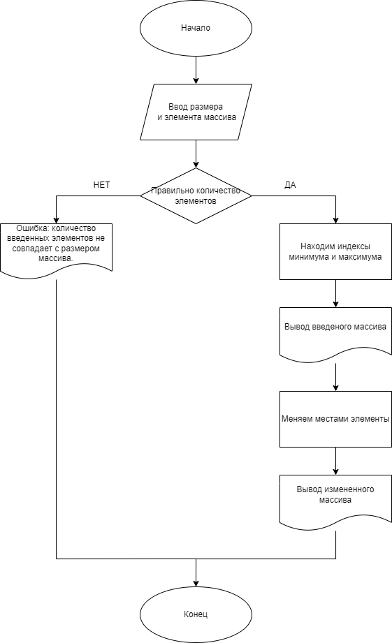

# Практическая работа №1

### Тема: Преобразование рядов чисел

### Цель: приобрести навыки составления программ с использованием преобразования рядов чисел

#### Ход работы

##### Задание:
> Дан массив размера N. Поменять местами его минимальный и максимальный элементы.

##### Контрольный пример:
> Вводим размер массива: `5`, вводим элементы массива: `[84, 91, 43, 65, 465]`, получаем результат: `[84, 91, 465, 65, 43]`
> Вводим размер массива: `1`, вводим элементы массива: `[23, 54]`, получаем ошибку`

##### Системный анализ:
> Входные данные: `n`, `arr`

> Промежуточные данные: `min_index`, `max_index`

> Выходные данные: `print`

##### Блок-схема:


##### Код программы (Консольный вариант):
```python
n = int(input("Введите размер массива: "))
arr = list(map(int, input(f"Введите {n} целых чисел через пробел: ").split()))

if len(arr) != n:
    print("Ошибка: количество введенных элементов не совпадает с размером массива.")
else:
    min_index = arr.index(min(arr))
    max_index = arr.index(max(arr))

    print("Массив до обмена:", arr)

    arr[min_index], arr[max_index] = arr[max_index], arr[min_index]

    print("Массив после обмена:", arr)
```

##### Код программы (Оконный вариант):
```python
import tkinter as tk
from tkinter import messagebox


def swap_min_max():
    try:
        n = int(entry_n.get())
        arr = list(map(int, entry_arr.get().split()))

        if len(arr) != n:
            messagebox.showerror("Ошибка", "Количество элементов не совпадает с размером массива.")
            return

        min_val = min(arr)
        max_val = max(arr)
        min_index = arr.index(min_val)
        max_index = arr.index(max_val)

        arr[min_index], arr[max_index] = max_val, min_val

        result_label.config(text="Массив после обмена: " + ' '.join(map(str, arr)))

    except ValueError:
        messagebox.showerror("Ошибка", "Пожалуйста, введите корректные числа.")


root = tk.Tk()
root.title("пр1")
root.geometry("400x250")

label_n = tk.Label(root, text="Введите размер массива:")
label_n.pack(pady=5)

entry_n = tk.Entry(root)
entry_n.pack(pady=5)

label_arr = tk.Label(root, text="Введите элементы массива через пробел:")
label_arr.pack(pady=5)

entry_arr = tk.Entry(root, width=40)
entry_arr.pack(pady=5)

btn = tk.Button(root, text="Выполнить", command=swap_min_max)
btn.pack(pady=10)

result_label = tk.Label(root, text="", fg="blue")
result_label.pack(pady=10)

root.mainloop()
```
##### Результат работы программы (Консольный вариант):

* Положительные числа    


* Элементы больше количества    


* Отрицательные числа    


##### Результат работы программы (Оконный вариант):

* Положительные числа    


* Элементы больше количества    


* Отрицательные числа    


##### Вывод по проделанной работе: #####
> Я освоил навыки составления программ с использованием преобразования рядов чисел.