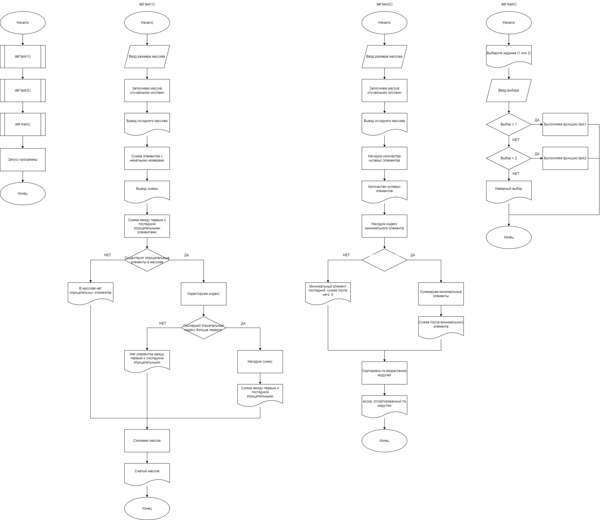
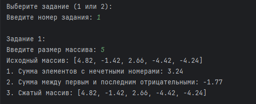
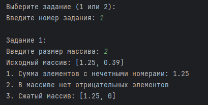
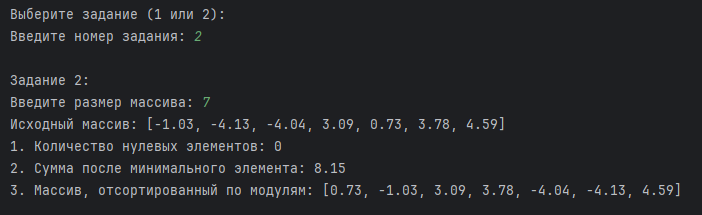
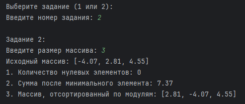

# Практическая работа №1

### Тема: Преобразование рядов чисел

### Цель: приобрести навыки составления программ с использованием преобразования рядов чисел

#### Ход работы

##### Задание:
> Дан массив размера N. Заменить каждый элемент массива на среднее арифметическое этого элемента и его соседей.

##### Контрольный пример:
> Вводим размер массива: `5`, вводим элементы массива: `[84, 91, 43, 65, 465]`, получаем результат: `[58.33, 72.66, 66.33, 191.0, 176.66]`

##### Системный анализ:
> Входные данные: `n`, `num`

> Промежуточные данные: `arr`, `new_arr`, `left`, `right`, `avg`

> Выходные данные: `print`

##### Блок-схема:


##### Код программы (Консольный вариант):
```python
n = int(input("Введите размер массива: "))

arr = []
for i in range(n):
    num = float(input(f"Введите элемент {i+1}: "))
    arr.append(num)

new_arr = []

for i in range(n):
    left = arr[i - 1] if i > 0 else 0
    right = arr[i + 1] if i < n - 1 else 0

    avg = (arr[i] + left + right) / 3
    new_arr.append(avg)

print("Новый массив:", new_arr)
```

##### Код программы (Оконный вариант):
```python
import tkinter as tk
from tkinter import messagebox

def calculate():
    try:
        n = int(entry_n.get())
        if n <= 0:
            messagebox.showerror("Ошибка", "Размер массива должен быть положительным числом.")
            return

        arr = []
        for i in range(n):
            val = float(entries[i].get())
            arr.append(val)

        new_arr = []
        for i in range(n):
            if i == 0:
                avg = (arr[i] + arr[i + 1]) / 2
            elif i == n - 1:
                avg = (arr[i] + arr[i - 1]) / 2
            else:
                avg = (arr[i] + arr[i - 1] + arr[i + 1]) / 3
            new_arr.append(avg)

        formatted_result = [f"{x:.2f}" for x in new_arr]

        result_str = ", ".join(formatted_result)
        messagebox.showinfo("Результат", f"Новый массив:\n{result_str}")

    except ValueError:
        messagebox.showerror("Ошибка", "Пожалуйста, введите корректные числа.")

root = tk.Tk()
root.title("Ввод массива")
root.geometry("400x400")

label_n = tk.Label(root, text="Введите размер массива:")
label_n.pack(pady=5)

entry_n = tk.Entry(root)
entry_n.pack(pady=5)

entries = []

def create_entries():
    global entries
    n = int(entry_n.get())
    for widget in frame.winfo_children():
        widget.destroy()
    entries.clear()

    for i in range(n):
        label = tk.Label(frame, text=f"Элемент {i+1}:")
        label.pack(side=tk.LEFT, padx=5)
        entry = tk.Entry(frame, width=5)
        entry.pack(side=tk.LEFT, padx=5)
        entries.append(entry)

btn_create = tk.Button(root, text="Создать поля", command=create_entries)
btn_create.pack(pady=10)

frame = tk.Frame(root)
frame.pack(pady=10)

btn_calculate = tk.Button(root, text="Вычислить", command=calculate)
btn_calculate.pack(pady=10)

root.mainloop()
```
##### Результат работы программы (Консольный вариант):

* Новый массив    


* Элементы 0 и 1   



##### Результат работы программы (Оконный вариант):

* Новый массив   


* Элементы 0 и 1   


##### Вывод по проделанной работе: #####
> Я освоил навыки составления программ с использованием преобразования рядов чисел.